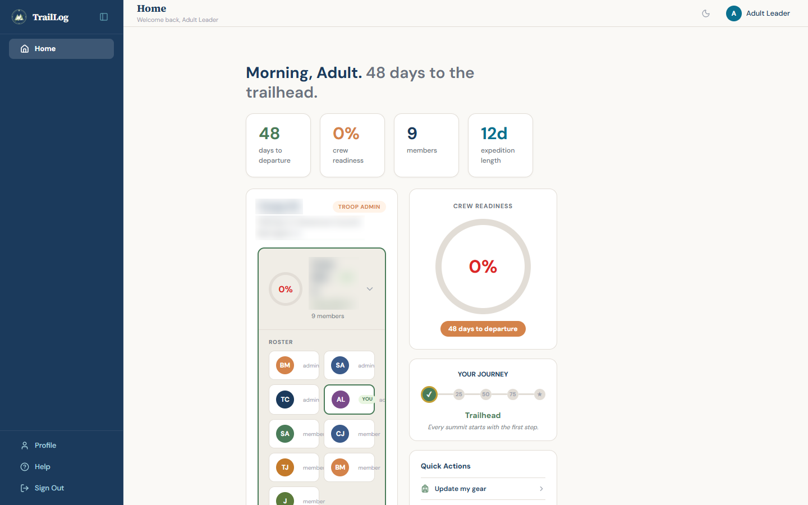
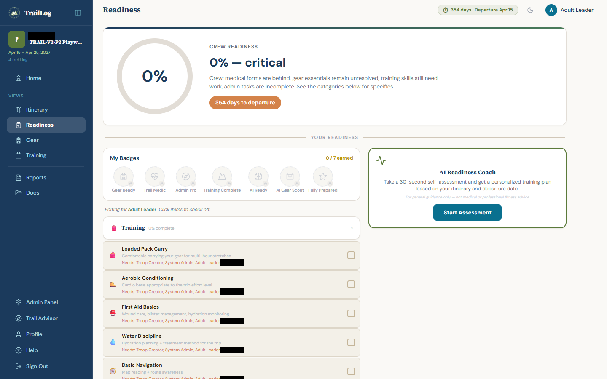
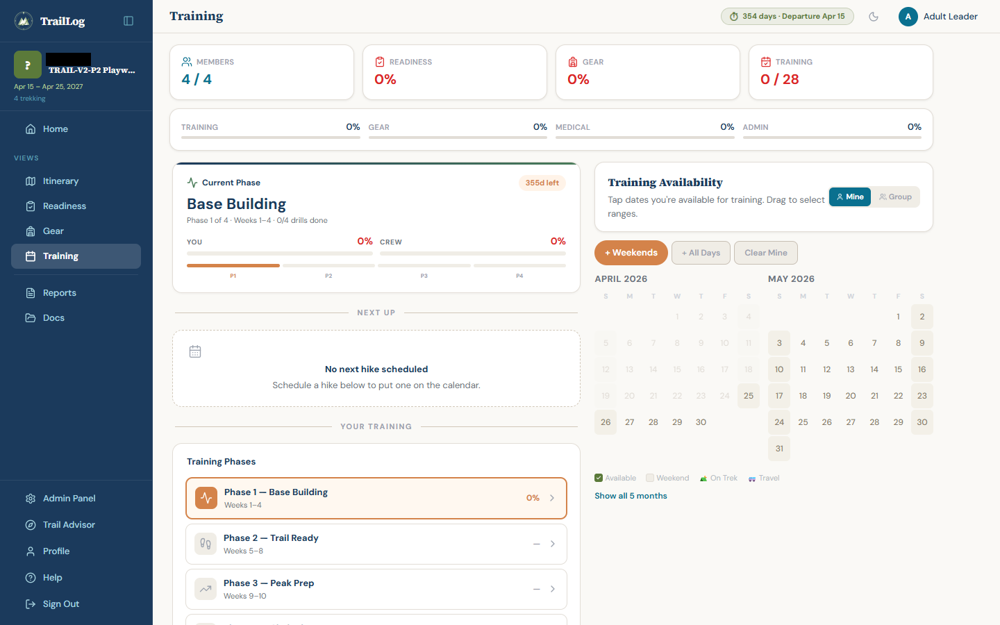
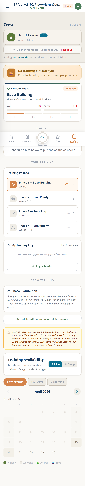

# TrailLog.ai

TrailLog.ai is a multi-tenant SaaS platform for BSA (Boy Scouts of America) high-adventure crew preparation — training, gear, readiness, and logistics across Philmont, Sea Base, Northern Tier, and Summit Bechtel. Built solo using Claude Code as the primary development tool. Portfolio project by Bill McCoy.

**Live:** [traillog.ai](https://traillog.ai) · Built by [GraceZero Ai](https://gracezero.ai)

---

## AI Architecture — Dual-Model Claude Orchestration

TrailLog's AI layer uses two Claude models with distinct roles, coordinated through a centralized model config (`server/config/models.js`). The routing decision maps directly to the cost/quality trade-off:

| Task | Model | Rationale |
|------|-------|-----------|
| Gear recommendations (weekly batch refresh, 68 items) | `claude-haiku-4-5` | High-volume, structured output, cost-optimized |
| AI readiness plan generation (on-demand, per member) | `claude-sonnet-4-6` | Complex reasoning, activity-aware, output quality matters |
| Real-time gear advisor chat | `claude-sonnet-4-6` | Conversational reasoning requires stronger model |

**Deterministic fallback:** When the API key is absent or the API returns an error, the readiness planner drops to a rule-based fallback (`generateFallbackPlan`) that produces the same JSON schema — same UI, no degraded experience, no exceptions surfaced to users. The AI upgrade is invisible to users when it's unavailable.

**Activity-aware coaching:** The readiness planner dispatches across four system prompts — Philmont backpacking, Northern Tier paddling, summit climbing, and general high-adventure — so the AI coach gives Philmont-specific advice to Philmont crews and paddling-specific advice to Northern Tier crews, not generic outdoor content.

**Token tracking:** Tokens consumed per API call are stored with each recommendation and plan for cost audit.

---

## Operations & Production Readiness

This isn't a demo — it's a production system with the operational rigor to match:

- **Automated daily backups** with rolling retention, size anomaly detection, and freshness verification
- **Four-layer monitoring**: external uptime (UptimeRobot), application errors (Sentry), query performance (pg_stat_statements), infrastructure health (custom cron every 15 min — 10 checks: disk, DB size, backup freshness, container health, memory, session bloat, error rate, brute-force detection)
- **Security hardening**: CSRF double-submit cookies, Helmet CSP, HSTS via Traefik, Zod input validation on 16 write endpoints, bcrypt password hashing, session regeneration on login, parameterized SQL with zero string concatenation, non-root Docker container
- **~270 Playwright E2E tests** across 27 specs covering auth flows, CRUD operations, security boundaries, visual regression, and cross-device screenshots across 4 viewport sizes; plus **69 server integration tests** (Vitest against real PostgreSQL)
- **Zero-downtime deploys** via Docker with Traefik reverse proxy and automatic Let's Encrypt TLS

---

## Quality Assurance

TrailLog uses a multi-layer testing strategy built for AI-era application development, where code changes are frequent, cross-platform, and often generated at speed.

**Testing Principles**

- **Always Both Platforms** — Every test runs on mobile and desktop, every time. No exceptions. Responsive layouts and shared state create invisible cross-platform dependencies that single-platform testing misses.
- **Fail-Fast Sequential** — Tests run in dependency order and stop on first failure. Fix the root cause, restart from test 1. This catches cascading regressions that parallel testing hides.
- **Session Regression** — Each development session produces a regression test covering every change from that session's changelog. The test becomes a permanent part of the suite, ensuring future changes don't break prior work.
- **Human-in-the-Loop** — AI proposes changes and generates tests, but a human reviews every plan before implementation, approves every deploy, and visually inspects screenshot evidence before signing off. The developer decides what to build, what to test, and what ships. AI accelerates execution — it doesn't replace judgment.

**Test Pyramid**

| Layer | Tool | Tests | What It Validates |
|-------|------|-------|-------------------|
| Server Integration | [Vitest](https://vitest.dev/) | 69 (real PostgreSQL) | Database functions, API routes, auth flows, validation |
| E2E Features | [Playwright](https://playwright.dev/) | ~270 across 27 specs | Auth, CRUD, navigation, security, email (29 personas) |
| Full App Smoke | [Playwright serial mode](https://playwright.dev/docs/test-parallel#serial-mode) | 40 (mobile + desktop) | End-to-end app flow — auth, home, all views, interactions |
| Session Regression | [Playwright serial mode](https://playwright.dev/docs/test-parallel#serial-mode) | Per-session | Every changelog item verified on both platforms |
| Visual Screenshots | [Playwright device emulation](https://playwright.dev/docs/emulation#devices) | 28 (4 devices × 7 views) | iPhone 14, Pixel 7, Galaxy S24, Desktop 1440 |
| Visual Regression | [Playwright screenshot comparison](https://playwright.dev/docs/test-snapshots) | 11 | Pixel-diff comparison (5% tolerance) against baselines |

**AI-Assisted Testing**

Beyond traditional assertions, [Claude Code](https://docs.anthropic.com/en/docs/claude-code) with the [Chrome MCP extension](https://chromewebstore.google.com/detail/claude-in-chrome/diahigjngdnkdgajdbhbkmdpniglnbhe) provides visual reasoning — examining screenshots to identify layout issues, misaligned elements, and UX problems that code-level assertions can't catch. The AI compares mobile vs desktop behavior, flags inconsistencies, and compresses the fix-and-verify feedback cycle from hours to minutes.

---

## Features

- **Multi-Tenant SaaS** — Troops scoped by BSA council. Public discovery or private invite-only. Phase 1 is free for all users, supported by affiliate gear links with full transparent disclosure (no hidden monetization). Multi-tier model planned for Phase 2.
- **Multi-Crew / Sister Crew Support** — Adventures can have multiple crews with their own rosters and itineraries. "All Crews" view combines availability heat maps across sister crews so troop leaders can coordinate joint training.
- **AI Readiness Plans** — Claude Sonnet generates personalized multi-phase training plans based on a self-assessment (fitness, hiking experience, altitude exposure, prior high-adventure experience, biggest anxiety), tailored to trek activity type and timeline. Activity-aware: Philmont coaches don't give paddling advice. Deterministic fallback ensures no broken experience when the API is unavailable.
- **AI Gear Recommendations** — Claude Haiku runs a weekly background refresh across the full 68-item gear catalog, generating top-3 product recommendations per item with weight, price range, and rationale. Results are cached in the database (7-day TTL) and served from there — the UX feels instant.
- **Training Calendar & Phases** — Crew-wide availability heat map. Four-phase training progression (Base Building → Trail Ready → Peak Prep → Shakedown) with per-member drill tracking. Multi-date polls for scheduling group training events. Personal training log with post-hike prompts.
- **Itinerary & Day Planning** — 48 selectable Philmont itineraries with day-by-day camps, mileage, elevation, and program highlights. Custom day planner for non-preset high-adventure trips. Prep Events with RSVP and attendance tracking. Travel Legs with driver signup. Printable Trek Packet.
- **Gear Catalog** — 68-item Philmont-specific catalog with 3-state tracking (needed → owned → packed), pack weight calculator, category/priority filters, and affiliate product links.
- **Readiness Dashboard** — Individual and crew readiness across 4 categories (training, gear, medical, admin). Desktop BI layout with trend charts, sortable members table, and drill-down panels.
- **Gamification** — Auto-awarded trail badges (7 types) with email notifications. Journey waypoint progress trail tracks crew-wide readiness from Trailhead to Summit.
- **Parent-Scout Linking** — Support adults linked to scouts via email match, request/approve, or admin override. Parent dashboard shows linked scout progress.
- **Reports & Excel Export** — Crew rosters, gear matrices, pack weight summaries, training RSVPs, and readiness reports. Export to Excel or print.
- **Mobile-First Responsive** — Works on any device, no app download. Compact header on mobile, full desktop BI layout at 1024px+ with collapsible sidebar and separate navigation chrome.
- **13 Transactional Emails** — Invitations, approvals, date changes, badge awards, training reminders, password reset, email verification, and more.

---

## Screenshots

### Home Dashboard — Crew Roster, Readiness Ring, Journey Progress

### Gear View — BI Layout with Catalog, Member Table, and Completion Chart

### Readiness View — AI Coach Entry Point and Skills Checklist

### Training V5 — Phase Progression and Availability Calendar

### Training V5 — Full Mobile View

### Mobile Landing Page

---

## Tech Stack

| Layer | Technology | Details |
|-------|-----------|---------|
| Frontend | React 18, Vite 6, TypeScript | 111 components, 32 code-split via `lazyWithRetry` |
| Styling | Tailwind CSS v4, clsx | CSS custom properties, dark mode via `dark` class toggle |
| Backend | Express.js 4 | 13 route modules, 228 async database functions |
| Database | PostgreSQL (node-postgres) | 50 schema tables (v2), async pool, parameterized queries only |
| Auth | Passport.js, bcrypt | Google OAuth + email/password, 4 RBAC roles |
| AI | Anthropic Claude API | Haiku (gear batch) + Sonnet (readiness + chat), deterministic fallback |
| Security | Helmet.js, express-rate-limit, CSRF | Double-submit cookie, CSP no unsafe-inline, HSTS, 16 Zod schemas |
| Email | Nodemailer | Gmail SMTP, 13 transactional templates |
| Charts | Recharts (lazy-loaded) | Readiness trends, gear completion, isolated to lazy chunks |
| Testing | Playwright + Vitest | 27 specs / ~270 E2E tests + 69 server integration tests |
| Monitoring | Sentry, UptimeRobot, custom cron | Error tracking, uptime, 10-check infra monitor every 15 min |
| Deployment | Docker, Traefik | Containerized, auto-HTTPS, zero-downtime redeploys |

### Architecture Highlights

- **Dual-model AI routing** — `server/config/models.js` is the single source of truth for model selection. Alias strings (no date-pinned versions) so model upgrades happen in one place. Haiku handles high-volume batch work; Sonnet handles reasoning-heavy user-facing features.
- **Frontend migrated from JavaScript to TypeScript** (March 2026) — all client files converted from JS/JSX to TS/TSX with centralized type definitions.
- **Tailwind CSS v4** replaced inline styles — CSS custom properties, component classes (`tl-card`, `tl-btn`, `tl-badge`), dark class toggle for dark mode.
- **React.lazy code splitting** for 32 components (via `lazyWithRetry` with automatic reload on stale chunks) reduced the main bundle from 599KB to 226KB gzip.
- **PostgreSQL** replaced SQLite (March 2026) — 228 async database functions, parameterized queries throughout, connection pooling via `pg.Pool`.
- **29 isolated Playwright auth sessions** enable fully parallel E2E testing with zero session contention.
- **Sentry error tracking** on both Express and React — unhandled exceptions captured with full stack traces, request context, and environment tags.
- **Infrastructure monitoring** via custom cron scripts: disk, database size, backup verification, container health, memory leaks, session table bloat, error rate spikes, and brute force detection.

For a deeper look at system design, data model, API patterns, and key engineering decisions, see [ARCHITECTURE.md](ARCHITECTURE.md).

---

## Built With Claude Code

This project was built using [Claude Code](https://claude.ai/code) as the primary development tool. The human contributions were product design, system architecture, UX decisions, and technical judgment — Claude Code handled implementation across the full stack, from database schema to React components to Playwright test suites. This represents a deliberate approach to AI-assisted development as a professional skill, not a shortcut.

Every architectural decision, security boundary, and design trade-off was directed by a human engineer with Claude Code translating those decisions into working code. The workflow deliberately preserves human oversight at every meaningful gate: plan review before implementation, visual inspection before commit, manual approval before deploy. This is the engineering model that makes AI-assisted development scale safely — not prompting and hoping, but directing, reviewing, and owning the output.

---

## Documentation

- [Architecture](ARCHITECTURE.md) — System design, data model, API patterns, infrastructure, and key engineering decisions
- [Security Policy](SECURITY.md) — Vulnerability reporting and disclosure

---

## This Repository

This is the public portfolio version of TrailLog. It includes screenshots and system design documentation to showcase the project's scope and engineering quality. The full source code is maintained in a private repository. Code samples and live demos are available upon request for interviews.

---

## License

MIT
