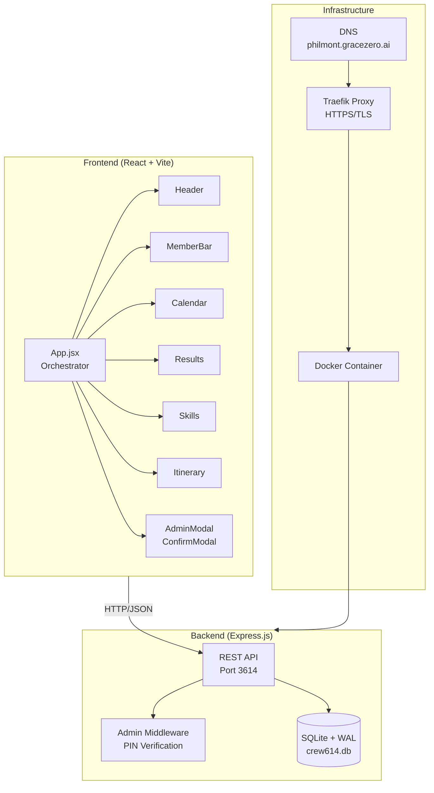
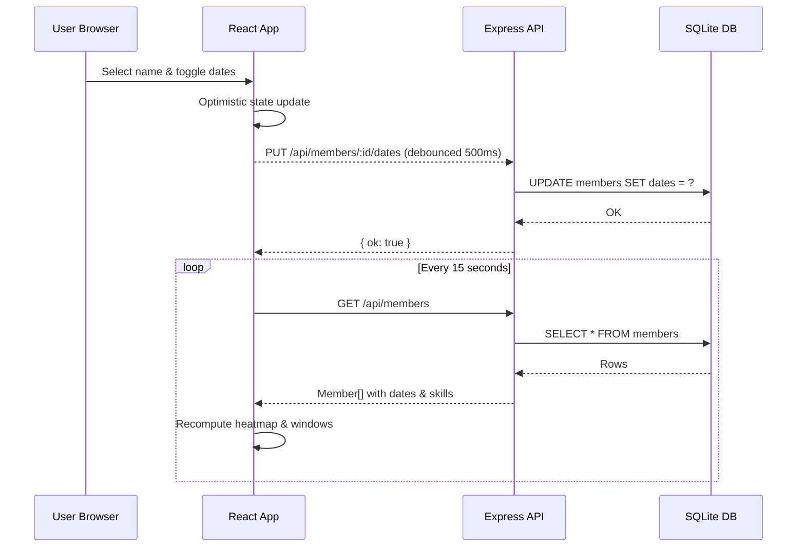
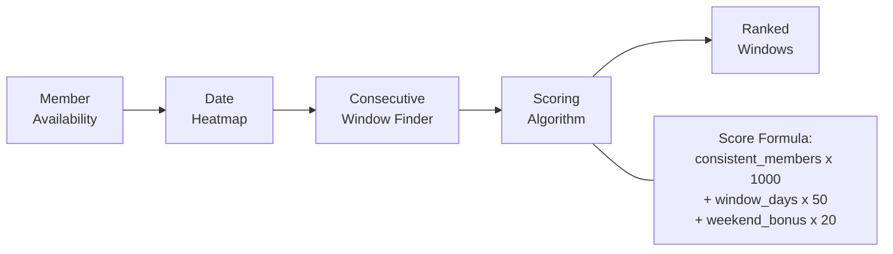
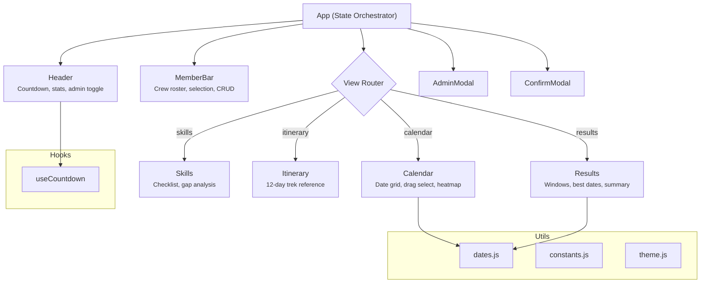

# Crew 614 Training Coordinator

A real-time collaborative scheduling platform for Philmont Scout Ranch crew training coordination. Parents visit the same URL, select their name, mark available dates, and the app intelligently finds optimal overlapping training windows for the group.

**Live:** [philmont.gracezero.ai](https://philmont.gracezero.ai)

---

## Features

- **Interactive Calendar** — Click or drag to select availability. Heatmap visualization shows group overlap at a glance.
- **Smart Window Finder** — Algorithm identifies the best consecutive-day training windows, scored by crew attendance, duration, and weekend bonus.
- **Skills Tracker** — Track completion of 8 critical backcountry skills across all crew members with gap analysis.
- **Itinerary Reference** — 12-day trek details with elevation profiles, mileage, camp types, and training priorities.
- **Real-time Sync** — 15-second auto-polling keeps all users in sync without manual refresh.
- **Admin Controls** — PIN-protected admin mode for managing crew roster and custom skills.

---

## Architecture

### System Overview



### Data Flow



### Analysis Engine



### Component Architecture



---

## Tech Stack

| Layer | Technology | Purpose |
|-------|-----------|---------|
| Frontend | React 18, Vite 6 | Component UI, fast HMR dev |
| Backend | Express.js 4 | REST API server |
| Database | SQLite (better-sqlite3) | Embedded DB with WAL mode |
| Deployment | Docker, Traefik | Containerized with auto-HTTPS |
| Fonts | Playfair Display, Instrument Sans | Typography system |

---

## Project Structure

```
crew614/
├── client/
│   ├── src/
│   │   ├── components/
│   │   │   ├── Header.jsx         # App header + countdown timer
│   │   │   ├── MemberBar.jsx      # Crew roster management
│   │   │   ├── Calendar.jsx       # Interactive date picker + heatmap
│   │   │   ├── Results.jsx        # Analysis & training windows
│   │   │   ├── Skills.jsx         # Skills checklist + gap analysis
│   │   │   ├── Itinerary.jsx      # Trek reference view
│   │   │   ├── AdminModal.jsx     # Admin PIN authentication
│   │   │   └── ConfirmModal.jsx   # Destructive action confirmation
│   │   ├── hooks/
│   │   │   └── useCountdown.js    # Real-time countdown hook
│   │   ├── utils/
│   │   │   ├── constants.js       # Itinerary data, travel date, config
│   │   │   ├── dates.js           # Date manipulation helpers
│   │   │   └── theme.js           # Shared style system
│   │   ├── api.js                 # API client wrapper
│   │   ├── App.jsx                # Root orchestrator component
│   │   └── main.jsx               # React entry point
│   ├── index.html
│   ├── vite.config.js
│   └── package.json
├── server/
│   ├── index.js                   # Express server + routes
│   ├── db.js                      # SQLite schema, queries, seeds
│   └── package.json
├── Dockerfile                     # Multi-stage production build
├── docker-compose.yml             # Container orchestration
└── README.md
```

---

## API Endpoints

| Method | Endpoint | Auth | Description |
|--------|----------|------|-------------|
| `GET` | `/api/members` | — | List all crew members |
| `POST` | `/api/members` | Admin | Add a crew member |
| `DELETE` | `/api/members/:id` | Admin | Remove a crew member |
| `PUT` | `/api/members/:id/dates` | — | Update availability dates |
| `PUT` | `/api/members/:id/skills` | — | Update completed skills |
| `GET` | `/api/skills` | — | List all training skills |
| `POST` | `/api/skills` | Admin | Add a custom skill |
| `DELETE` | `/api/skills/:id` | Admin | Remove a custom skill |
| `POST` | `/api/admin/verify` | — | Verify admin PIN |
| `POST` | `/api/admin/reset` | Admin | Reset all data |

---

## Quick Start

### Development

```bash
# Terminal 1 — Backend
cd server && npm install && npm run dev

# Terminal 2 — Frontend
cd client && npm install && npm run dev
```

Frontend runs at `http://localhost:5173` with API proxy to `localhost:3614`.

### Production (Docker)

```bash
docker compose up -d --build
```

Runs on port `3614`. Point your reverse proxy (Traefik/nginx) to this port for HTTPS.

### Environment Variables

| Variable | Default | Description |
|----------|---------|-------------|
| `PORT` | `3614` | Server port |
| `ADMIN_PIN` | `614` | Admin authentication PIN |
| `DATA_DIR` | `./data` | SQLite database directory |

---

## Database Schema

```sql
-- Crew members with availability and skills tracking
CREATE TABLE members (
  id         INTEGER PRIMARY KEY AUTOINCREMENT,
  name       TEXT NOT NULL UNIQUE,
  color_bg   TEXT NOT NULL,
  dates      TEXT NOT NULL DEFAULT '[]',    -- JSON array of date keys
  skills     TEXT NOT NULL DEFAULT '[]',    -- JSON array of skill IDs
  created_at DATETIME DEFAULT CURRENT_TIMESTAMP
);

-- Training skills (8 defaults + custom)
CREATE TABLE skills (
  id          TEXT PRIMARY KEY,
  name        TEXT NOT NULL,
  icon        TEXT NOT NULL DEFAULT '📋',
  description TEXT NOT NULL DEFAULT '',
  is_default  INTEGER NOT NULL DEFAULT 0,
  sort_order  INTEGER NOT NULL DEFAULT 0
);
```

---

## License

MIT
