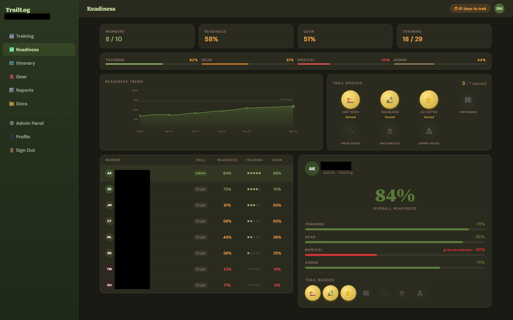
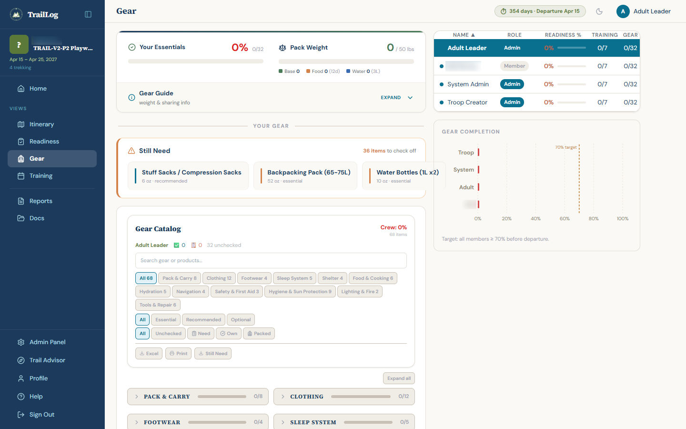
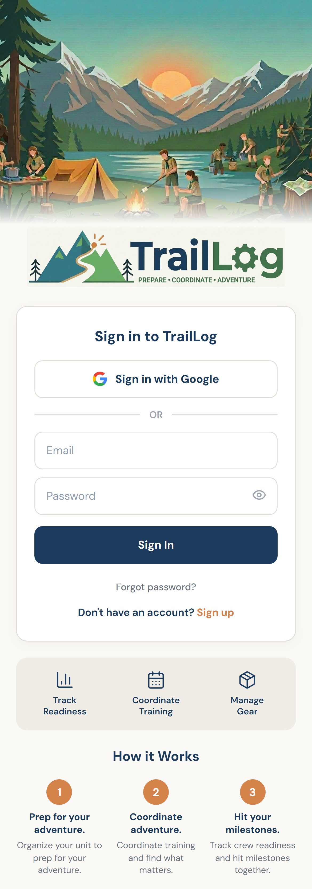

# TrailLog

TrailLog is a multi-tenant SaaS platform for BSA high-adventure crew preparation — training, gear, readiness, and logistics across Philmont, Sea Base, Northern Tier, and Summit Bechtel. Built solo using Claude Code as the primary development tool. Portfolio project by Bill McCoy.

**Live:** [traillog.ai](https://traillog.ai) · Built by [GraceZero Ai](https://gracezero.ai)

---

## Operations & Production Readiness

This isn't a demo — it's a production system with the operational rigor to match:

- **Automated daily backups** with rolling retention, size anomaly detection, and freshness verification
- **Four-layer monitoring**: external uptime (UptimeRobot), application errors (Sentry), query performance (pg_stat_statements), infrastructure health (custom cron)
- **Security hardening**: CSRF double-submit cookies, Helmet CSP, Zod input validation on 16 route groups, bcrypt password hashing, session regeneration on login, parameterized SQL (zero string concatenation), non-root Docker container
- **215+ Playwright E2E tests** across 20 specs covering auth flows, CRUD operations, security boundaries, visual regression, and cross-device screenshots across 4 viewport sizes
- **Zero-downtime deploys** via Docker with Traefik reverse proxy and automatic Let's Encrypt TLS

---

## Quality Assurance

TrailLog uses a multi-layer testing strategy built for AI-era application development, where code changes are frequent, cross-platform, and often generated at speed.

**Testing Principles**

- **Always Both Platforms** — Every test runs on mobile and desktop, every time. No exceptions. Responsive layouts and shared state create invisible cross-platform dependencies that single-platform testing misses.
- **Fail-Fast Sequential** — Tests run in dependency order and stop on first failure. Fix the root cause, restart from test 1. This catches cascading regressions that parallel testing hides. Based on the smoke test pattern from [Continuous Delivery](https://continuousdelivery.com/) (Humble & Farley).
- **Session Regression** — Each development session produces a regression test covering every change from that session's changelog. The test becomes a permanent part of the suite, ensuring future changes don't break prior work.
- **Human-in-the-Loop** — AI proposes changes and generates tests, but a human reviews every plan before implementation, approves every deploy, and visually inspects screenshot evidence before signing off. The developer decides what to build, what to test, and what ships. AI accelerates execution — it doesn't replace judgment.

**Test Pyramid**

| Layer | Tool | Tests | What It Validates |
|-------|------|-------|-------------------|
| Server Unit | [Vitest](https://vitest.dev/) | Fast | Database functions, validation, business logic |
| E2E Features | [Playwright](https://playwright.dev/) | 215+ across 20 specs | Auth, CRUD, navigation, security, email (29 personas) |
| Full App Smoke | [Playwright serial mode](https://playwright.dev/docs/test-parallel#serial-mode) | 40 (mobile + desktop) | End-to-end app flow — auth, home, all views, interactions |
| Session Regression | [Playwright serial mode](https://playwright.dev/docs/test-parallel#serial-mode) | Per-session | Every changelog item verified on both platforms |
| Visual Screenshots | [Playwright device emulation](https://playwright.dev/docs/emulation#devices) | 28 (4 devices x 7 views) | iPhone 14, Pixel 7, Galaxy S24, Desktop 1440 |
| Visual Regression | [Playwright screenshot comparison](https://playwright.dev/docs/test-snapshots) | 11 | Pixel-diff comparison (5% tolerance) against baselines |

**AI-Assisted Testing**

Beyond traditional assertions, [Claude Code](https://docs.anthropic.com/en/docs/claude-code) with the [Chrome MCP extension](https://chromewebstore.google.com/detail/claude-in-chrome/diahigjngdnkdgajdbhbkmdpniglnbhe) provides visual reasoning — examining screenshots to identify layout issues, misaligned elements, and UX problems that code-level assertions can't catch. The AI compares mobile vs desktop behavior, flags inconsistencies, and compresses the fix-and-verify feedback cycle from hours to minutes. The developer reviews AI-generated test results and screenshots before any code is committed.

**Toolchain**

| Tool | Purpose | Reference |
|------|---------|-----------|
| [Playwright](https://playwright.dev/) | Browser automation and E2E testing across Chromium, Firefox, WebKit | [Getting Started](https://playwright.dev/docs/intro) |
| [Vitest](https://vitest.dev/) | Fast unit test runner for Node.js, compatible with Jest API | [Getting Started](https://vitest.dev/guide/) |
| [Claude Code](https://docs.anthropic.com/en/docs/claude-code) | AI coding agent — plans, implements, tests, and deploys with human approval | [Documentation](https://docs.anthropic.com/en/docs/claude-code) |
| [Chrome MCP](https://chromewebstore.google.com/detail/claude-in-chrome/diahigjngdnkdgajdbhbkmdpniglnbhe) | Connects Claude Code to a live Chrome browser for visual verification | [Chrome Web Store](https://chromewebstore.google.com/detail/claude-in-chrome/diahigjngdnkdgajdbhbkmdpniglnbhe) |
| [Sentry](https://sentry.io/) | Runtime error tracking and performance monitoring (client + server) | [Docs](https://docs.sentry.io/) |
| [UptimeRobot](https://uptimerobot.com/) | External uptime monitoring — pings health endpoint every 5 minutes | [How It Works](https://uptimerobot.com/about) |

---

## Features

- **Multi-Tenant SaaS** — Troops scoped by BSA council. Public discovery or private invite-only. 90-day free trial for crew leaders (full access, no credit card required). After trial: $3.99 per user per year — one price, every feature, no tiers. Scouts and crew members are always free.
- **Multi-Crew / Sister Crew Support** — Adventures can have multiple crews with their own rosters and itineraries. "All Crews" view combines availability heat maps across sister crews so troop leaders can coordinate joint training.
- **AI Training Plans** — Claude AI generates personalized multi-phase training plans based on a self-assessment (fitness, hiking experience, altitude exposure), tailored to trek difficulty and timeline.
- **Training Calendar** — Drag-to-select availability with crew overlap heat map. Algorithm scores consecutive-day windows by attendance, duration, and weekend bonus to find the best training dates.
- **48 Selectable Itineraries** — Philmont routes loaded with day-by-day camps, mileage, elevation, and program highlights. Admins pick the itinerary for their crew. Printable pocket cheat sheets for the trail.
- **Gear Catalog** — 68-item Philmont-specific catalog with 3-state tracking (needed → owned → packed), pack weight calculator, category/priority filters, and affiliate product links.
- **Readiness Dashboard** — Individual and crew readiness across 4 categories (training, gear, medical, admin). Desktop BI layout with trend charts, sortable members table, and drill-down panels.
- **Gamification** — Auto-awarded trail badges with email notifications. Journey waypoint progress trail tracks crew-wide readiness from Trailhead to Summit.
- **Parent-Scout Linking** — Support adults linked to scouts via email match, request/approve, or admin override. Parent dashboard shows linked scout progress.
- **Reports & Excel Export** — Crew rosters, gear matrices, pack weight summaries, training RSVPs, and readiness reports. Export to Excel or print.
- **Mobile-First Responsive** — Works on any device, no app download. Compact hero bar on mobile, full desktop BI layout at 1024px+ with collapsible sidebar.
- **13 Transactional Emails** — Invitations, approvals, date changes, badge awards, training reminders, password reset, and more.

---

## Screenshots

### Readiness View — Desktop BI with Member Drill-Down

### Gear View — Desktop BI with Completion Chart

### Mobile Landing Page

---

## Tech Stack

| Layer | Technology | Purpose |
|-------|-----------|---------|
| Frontend | React 18, Vite 6, TypeScript | Component UI, type-safe, fast HMR dev |
| Styling | Tailwind CSS v4, clsx | Utility-first CSS with dark mode |
| Backend | Express.js 4 | REST API (144 routes across 7 modules) |
| Database | PostgreSQL (pg / node-postgres) | Async pool, 32 tables, schema v25 |
| Auth | Passport.js, bcrypt | Google OAuth + email/password |
| Security | Helmet.js, express-rate-limit, CSRF | Headers, rate limiting, double-submit cookie |
| Email | Nodemailer | Gmail SMTP (13 transactional templates) |
| Charts | Recharts (lazy-loaded) | Readiness trends, gear completion |
| Testing | Playwright (20 specs, 215+ tests) | E2E, visual regression, security |
| Monitoring | Sentry, UptimeRobot, pg_stat_statements | Error tracking, uptime, query performance |
| Deployment | Docker, Traefik | Containerized with auto-HTTPS |

### Architecture Highlights

- **Frontend migrated from JavaScript to TypeScript** (March 2026) — all client files converted from JS/JSX to TS/TSX with centralized type definitions.
- **Tailwind CSS v4** replaced inline styles — CSS custom properties, component classes, dark class toggle for dark mode.
- **React.lazy code splitting** for 27 components reduced the main bundle from 599KB to 226KB gzip. All Recharts imports are isolated to lazy-loaded chart chunks.
- **PostgreSQL** replaced SQLite (March 2026) — 182 async database functions, parameterized queries, connection pooling via pg.Pool.
- **29 isolated Playwright auth sessions** enable fully parallel E2E testing with zero session contention.
- **Sentry error tracking** on both Express and React — unhandled exceptions captured with full stack traces, request context, and environment tags.
- **Infrastructure monitoring** via custom cron scripts: disk, database size, backup verification, container health, memory leaks, session table bloat, error rate spikes, and brute force detection.

For a deeper look at system design, data model, API patterns, and key engineering decisions, see [ARCHITECTURE.md](ARCHITECTURE.md).

---

## Built With Claude Code

This project was built using [Claude Code](https://claude.ai/code) as the primary development tool. The human contributions were product design, system architecture, UX decisions, and technical judgment — Claude Code handled implementation across the full stack, from database schema to React components to Playwright test suites. This represents a deliberate approach to AI-assisted development as a professional skill, not a shortcut.

Every architectural decision, security boundary, and design trade-off was directed by a human engineer with Claude Code translating those decisions into working code. The workflow deliberately preserves human oversight at every meaningful gate: plan review before implementation, visual inspection before commit, manual approval before deploy. This is the engineering model that makes AI-assisted development scale safely — not prompting and hoping, but directing, reviewing, and owning the output.

---

## Documentation

- [Architecture](ARCHITECTURE.md) — System design, data model, API patterns, infrastructure, and key engineering decisions
- [Security Policy](SECURITY.md) — Vulnerability reporting and disclosure

---

## This Repository

This is the public portfolio version of TrailLog. It includes screenshots and system design documentation to showcase the project's scope and engineering quality. The full source code is maintained in a private repository. Code samples and live demos are available upon request for interviews.

---

## License

MIT
