# TrailLog Database Schema

> PostgreSQL · Schema version 25 · 33 tables · Generated 2026-03-18 · [migrated from SQLite 2026-03-18]

## Entity Relationship Diagram

```mermaid
erDiagram
    %% ═══════════════════════════════════════════
    %% TIER 0 — Independent tables
    %% ═══════════════════════════════════════════

    users {
        int id PK
        text google_id UK
        text email UK
        text password_hash
        text name
        text avatar_url
        text user_type
        text parent_email
        text parent_email_2
        int email_verified
        text verification_token
        text age_confirmed
        datetime age_confirmed_at
        text reset_token
        datetime reset_token_expires
        datetime tos_accepted_at
        int is_admin
        datetime created_at
    }

    itineraries {
        text id PK
        text name
        int days
        real miles
        text rating
        text highlights
        text route_data
        text training_priorities
        text default_skills
        text global_info
        datetime created_at
    }

    councils {
        int id PK
        text name UK
        int council_num
        text city
        text state
    }

    platform_settings {
        text key PK
        text value
    }

    sessions {
        text sid PK
        text sess
        int expired
    }

    shirt_votes {
        int id PK
        text voter_name
        text design_id
        int vote_slot
        datetime created_at
        datetime updated_at
    }

    gear_catalog {
        int id PK
        text name
        text category
        text subcategory
        text description
        real weight_oz
        text weight_class
        text priority
        text sharing_type
        int active
        int sort_order
        datetime created_at
        datetime updated_at
    }

    gear_items {
        int id PK
        text name
        text description
        text category
        text affiliate_url
        text image_url
        text itinerary_tags
        text priority
        int sort_order
    }

    %% ═══════════════════════════════════════════
    %% TIER 1 — References Tier 0 only
    %% ═══════════════════════════════════════════

    troops {
        int id PK
        text name
        text description
        text trek_date
        text itinerary_id FK
        text itinerary_overrides
        text tier
        text amazon_affiliate_tag
        text council
        int council_id FK
        text location
        int is_public
        int created_by FK
        datetime created_at
    }

    troop_members {
        int id PK
        int user_id FK
        int troop_id FK
        text role
        text status
        text color_bg
        text dates
        text skills
        text participation
        text requested_adventures
        datetime created_at
    }

    gear_product_options {
        int id PK
        int gear_catalog_id FK
        text tier
        int star_rating
        text product_name
        text brand
        real price
        real weight_oz
        text notes
        int is_ultralight_pick
        int sort_order
        text affiliate_url
    }

    troop_gear_overrides {
        int troop_id PK_FK
        int gear_catalog_id PK_FK
        int hidden
    }

    troop_custom_gear {
        int id PK
        int troop_id FK
        text name
        text category
        text subcategory
        text description
        real weight_oz
        text priority
        text sharing_type
        int active
        int sort_order
        datetime created_at
    }

    ai_gear_recommendations {
        int id PK
        int gear_catalog_id FK
        text adventure_type
        text recommendations
        text generated_at
        text expires_at
        int tokens_used
    }

    affiliate_clicks {
        int id PK
        int user_id FK
        int product_option_id FK
        int gear_catalog_id FK
        text url
        text referrer
        datetime created_at
    }

    gear_ai_logs {
        int id PK
        int user_id FK
        int adventure_id
        text query
        text response
        int tokens_used
        datetime created_at
    }

    %% ═══════════════════════════════════════════
    %% TIER 2 — References Tier 1
    %% ═══════════════════════════════════════════

    adventures {
        int id PK
        int troop_id FK
        text name
        text description
        text trek_date
        text depart_date
        text arrive_date
        text return_date
        text home_date
        text itinerary_id FK
        text adventure_type
        text status
        text attendance_milestones
        int created_by FK
        datetime created_at
    }

    adventure_members {
        int id PK
        int adventure_id FK
        int user_id FK
        text role
        text participation
        int linked_to FK
        int linked_to_manual
        text linked_scouts
        int is_manual
        text manual_name
        text color_bg
        text dates
        text skills
        text gear
        text medical
        text admin_tasks
        datetime created_at
    }

    skills {
        text id PK
        int troop_id FK
        int adventure_id FK
        text name
        text icon
        text description
        text category
        int is_default
        int sort_order
        int is_system
    }

    invitations {
        int id PK
        int troop_id FK
        int adventure_id FK
        text email
        int invited_by FK
        text status
        text token UK
        datetime created_at
    }

    training_events {
        int id PK
        int adventure_id FK
        text date
        text period
        text time_label
        text location
        text notes
        text type
        text status
        int created_by FK
        datetime created_at
    }

    member_gear {
        int id PK
        int adventure_id FK
        int crew_id FK
        int user_id FK
        int gear_catalog_id FK
        text status
        int selected_option_id FK
        text custom_product_name
        real custom_weight_oz
        text notes
        datetime created_at
        datetime updated_at
    }

    adventure_documents {
        int id PK
        int adventure_id FK
        text name
        text original_name
        text file_path
        text mime_type
        int size
        text description
        int uploaded_by FK
        datetime created_at
    }

    %% ═══════════════════════════════════════════
    %% TIER 3 — References Tier 2
    %% ═══════════════════════════════════════════

    crews {
        int id PK
        int adventure_id FK
        text name
        text itinerary_id FK
        text depart_date
        text arrive_date
        text return_date
        text home_date
        int leader_id FK
        datetime created_at
    }

    crew_members {
        int id PK
        int crew_id FK
        int user_id FK
        text role
        text participation
        int linked_to FK
        int linked_to_manual
        text linked_scouts
        int is_manual
        text manual_name
        text color_bg
        text dates
        text skills
        text gear
        text medical
        text admin_tasks
        datetime created_at
    }

    achievements {
        int id PK
        int adventure_id FK
        int crew_id FK
        int user_id FK
        text badge_type
        datetime earned_at
    }

    crew_milestones {
        int id PK
        int adventure_id FK
        int crew_id FK
        text milestone_type
        datetime reached_at
    }

    link_requests {
        int id PK
        int adventure_id FK
        int requester_id FK
        int scout_id FK
        text status
        int reviewed_by FK
        datetime created_at
        datetime resolved_at
    }

    training_rsvps {
        int id PK
        int event_id FK
        int user_id FK
        text status
        datetime updated_at
    }

    training_attendance {
        int id PK
        int event_id FK
        int user_id FK
        int attended
        int marked_by FK
        datetime marked_at
    }

    %% ═══════════════════════════════════════════
    %% TIER 4 — References Tier 3
    %% ═══════════════════════════════════════════

    member_assessments {
        int id PK
        int crew_id FK
        int user_id FK
        real current_distance_miles
        text pack_experience
        text elevation_access
        text activity_level
        datetime assessed_at
    }

    readiness_plans {
        int id PK
        int crew_id FK
        int user_id FK
        text plan_json
        text priorities_json
        int weeks_at_generation
        datetime generated_at
    }

    readiness_progress {
        int id PK
        int crew_id FK
        int user_id FK
        int phase_number
        text status
        text note
        datetime updated_at
    }

    %% ═══════════════════════════════════════════
    %% RELATIONSHIPS
    %% ═══════════════════════════════════════════

    %% Troops
    users ||--o{ troops : "created_by"
    itineraries ||--o{ troops : "itinerary_id"
    councils ||--o{ troops : "council_id"

    %% Troop members
    users ||--o{ troop_members : "user_id"
    troops ||--o{ troop_members : "troop_id"

    %% Gear catalog children
    gear_catalog ||--o{ gear_product_options : "gear_catalog_id"
    gear_catalog ||--o{ ai_gear_recommendations : "gear_catalog_id"
    gear_catalog ||--o{ troop_gear_overrides : "gear_catalog_id"
    troops ||--o{ troop_gear_overrides : "troop_id"
    troops ||--o{ troop_custom_gear : "troop_id"

    %% Affiliate + AI logs
    users ||--o{ affiliate_clicks : "user_id"
    gear_product_options ||--o{ affiliate_clicks : "product_option_id"
    gear_catalog ||--o{ affiliate_clicks : "gear_catalog_id"
    users ||--o{ gear_ai_logs : "user_id"

    %% Adventures
    troops ||--o{ adventures : "troop_id"
    itineraries ||--o{ adventures : "itinerary_id"
    users ||--o{ adventures : "created_by"

    %% Adventure members
    adventures ||--o{ adventure_members : "adventure_id"
    users ||--o{ adventure_members : "user_id"
    users ||--o{ adventure_members : "linked_to"

    %% Skills
    troops ||--o{ skills : "troop_id"
    adventures ||--o{ skills : "adventure_id"

    %% Invitations
    troops ||--o{ invitations : "troop_id"
    adventures ||--o{ invitations : "adventure_id"
    users ||--o{ invitations : "invited_by"

    %% Training events
    adventures ||--o{ training_events : "adventure_id"
    users ||--o{ training_events : "created_by"

    %% Training RSVPs + Attendance
    training_events ||--o{ training_rsvps : "event_id"
    users ||--o{ training_rsvps : "user_id"
    training_events ||--o{ training_attendance : "event_id"
    users ||--o{ training_attendance : "user_id"
    users ||--o{ training_attendance : "marked_by"

    %% Member gear
    adventures ||--o{ member_gear : "adventure_id"
    users ||--o{ member_gear : "user_id"
    crews ||--o{ member_gear : "crew_id"
    gear_catalog ||--o{ member_gear : "gear_catalog_id"
    gear_product_options ||--o{ member_gear : "selected_option_id"

    %% Adventure documents
    adventures ||--o{ adventure_documents : "adventure_id"
    users ||--o{ adventure_documents : "uploaded_by"

    %% Crews
    adventures ||--o{ crews : "adventure_id"
    itineraries ||--o{ crews : "itinerary_id"
    users ||--o{ crews : "leader_id"

    %% Crew members
    crews ||--o{ crew_members : "crew_id"
    users ||--o{ crew_members : "user_id"
    users ||--o{ crew_members : "linked_to"

    %% Achievements + Milestones
    adventures ||--o{ achievements : "adventure_id"
    crews ||--o{ achievements : "crew_id"
    users ||--o{ achievements : "user_id"
    adventures ||--o{ crew_milestones : "adventure_id"
    crews ||--o{ crew_milestones : "crew_id"

    %% Link requests
    adventures ||--o{ link_requests : "adventure_id"
    users ||--o{ link_requests : "requester_id"
    users ||--o{ link_requests : "scout_id"
    users ||--o{ link_requests : "reviewed_by"

    %% Readiness (Tier 4)
    crews ||--o{ member_assessments : "crew_id"
    users ||--o{ member_assessments : "user_id"
    crews ||--o{ readiness_plans : "crew_id"
    users ||--o{ readiness_plans : "user_id"
    crews ||--o{ readiness_progress : "crew_id"
    users ||--o{ readiness_progress : "user_id"
```



## Table Summary

| Tier | Table | Rows (typical) | Purpose |
|------|-------|----------------|---------|
| 0 | `users` | 10–50 | User accounts (email + Google OAuth) |
| 0 | `itineraries` | 48 | Philmont trek templates (seeded) |
| 0 | `councils` | 350+ | BSA councils lookup (seeded) |
| 0 | `platform_settings` | ~8 | Maintenance mode, registration, announcements |
| 0 | `sessions` | variable | Express session store |
| 0 | `shirt_votes` | variable | T-shirt design voting (standalone) |
| 0 | `gear_catalog` | 76 | Master gear item list (admin-managed) |
| 0 | `gear_items` | — | **UNUSED** — superseded by gear_catalog (v5) |
| 1 | `troops` | 1–5 | Scout troops / units |
| 1 | `troop_members` | 10–50 | Troop membership + join requests |
| 1 | `gear_product_options` | 0 | Affiliate product links per gear item |
| 1 | `troop_gear_overrides` | 0–76 | Hide catalog items per troop |
| 1 | `troop_custom_gear` | 0–20 | Troop-specific custom gear items |
| 1 | `ai_gear_recommendations` | 0–76 | Cached AI gear recommendations |
| 1 | `affiliate_clicks` | variable | Affiliate link click tracking |
| 1 | `gear_ai_logs` | variable | AI gear chat conversation logs |
| 2 | `adventures` | 1–3 | Treks within a troop (Philmont, etc.) |
| 2 | `adventure_members` | 10–15 | Legacy membership (dual-write target) |
| 2 | `skills` | 5–20 | Readiness checklist items per adventure |
| 2 | `invitations` | 0–20 | Email invites to join troop/adventure |
| 2 | `training_events` | 0–10 | Scheduled hikes, meetings |
| 2 | `member_gear` | 0–1000 | Per-member gear selections |
| 2 | `adventure_documents` | 0–20 | Uploaded files (PDFs, images, etc.) |
| 3 | `crews` | 1–3 | Sub-groups within an adventure |
| 3 | `crew_members` | 10–15 | **Primary** membership table |
| 3 | `achievements` | 0–50 | Trail badges earned |
| 3 | `crew_milestones` | 0–5 | Journey waypoint progress |
| 3 | `link_requests` | 0–10 | Parent ↔ scout link requests |
| 3 | `training_rsvps` | 0–50 | Training event RSVPs (going/cant) |
| 3 | `training_attendance` | 0–50 | Post-event attendance records |
| 4 | `member_assessments` | 0–15 | AI readiness self-assessments |
| 4 | `readiness_plans` | 0–15 | AI-generated training plans |
| 4 | `readiness_progress` | 0–60 | Phase progress tracking |

## Key Data Flows

### Membership Hierarchy
```
User → Troop (via troop_members)
     → Adventure (via adventure_members — legacy dual-write)
     → Crew (via crew_members — PRIMARY)
```
- `crew_members` is the source of truth for membership data
- `adventure_members` is kept in sync via dual-write for rollback safety
- Each adventure auto-creates one default crew

### Readiness Scoring
```
crew_members.skills (JSON checkboxes)
  + member_gear status counts
  + crew_members.medical (JSON checkboxes)
  + crew_members.admin_tasks (JSON checkboxes)
  → 4-category readiness score (training, gear, medical, admin)
```

### Gear Pipeline
```
gear_catalog (global)
  - troop_gear_overrides (hide per troop)
  + troop_custom_gear (add per troop)
  → visible gear list per member
  → member_gear (status: needed/owned/packed)
  → pack weight calculation
```

## Foreign Key Enforcement

PostgreSQL enforces foreign key constraints by default. No additional configuration is
required at connection time, unlike SQLite which required a per-connection pragma.

## Indexes

**26 total** — 19 existing (created by `ensureIndexes()` in db.js) + 7 new (identified in D5 scan).

See [`schema.sql`](schema.sql) for the complete index list with query-pattern justifications.

**Not indexed** (intentionally):
- `users.reset_token` — rare single-row lookup (password reset)
- `users.verification_token` — one-time per user
- `users.is_admin` — < 5 rows in practice
- `shirt_votes.voter_name` — tiny standalone table

## Known Discrepancies (Code vs. Target)

| # | Issue | Impact | Resolution |
|---|-------|--------|------------|
| 1 | `adventure_members` missing `UNIQUE(adventure_id, user_id)` | Duplicate membership possible | Add constraint in future migration |
| 2 | `adventure_documents` FK uses RESTRICT (should CASCADE) | Documents orphaned if adventure delete bypasses transaction | Change to CASCADE |
| 3 | Most FKs use RESTRICT instead of CASCADE | Manual delete transactions required (harmless but verbose) | Align in schema migration |
| 4 | `gear_items` table is unused | Dead table from v5 migration | Drop in cleanup phase |
| 5 | `ai_gear_recommendations.gear_catalog_id` has no FK | Orphan rows possible if gear item deleted | Add FK with CASCADE |
| 6 | `gear_ai_logs.adventure_id` has no FK | Intentional — informational context only | No action needed |
| 7 | `member_gear` FK on adventure_id/user_id missing | Orphan rows possible | Add FKs with CASCADE |
| 8 | 7 indexes not yet created in runtime code | Slower queries on growing tables | Add to `ensureIndexes()` |

## Orphan Risk Assessment

| Risk | Tables | Likelihood | Mitigation |
|------|--------|------------|------------|
| Adventure deleted → members/gear/events orphaned | adventure_members, member_gear, training_events, etc. | Low (uses transaction) | `deleteAdventure()` manually deletes children |
| Troop deleted → adventures orphaned | adventures, troop_members | Low (uses transaction) | `deleteTroop()` manually deletes children |
| User deleted → training_events blocked | training_events.created_by RESTRICT | Medium | Should be SET NULL, not RESTRICT |
| User deleted → documents blocked | adventure_documents.uploaded_by RESTRICT | Medium | Should be SET NULL, not RESTRICT |
| Gear catalog item deleted → member_gear orphaned | member_gear (no FK in code) | Low (admin-only) | Add FK with CASCADE |

---

*Canonical schema definition: [`schema.pg.sql`](schema.pg.sql)*
*Branding reference: [`../docs/BRANDING_BIBLE.md`](../docs/BRANDING_BIBLE.md)*
