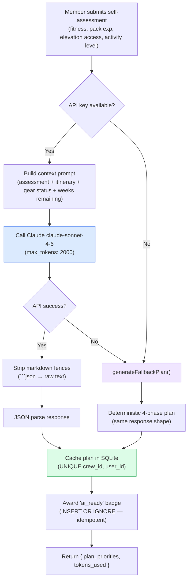
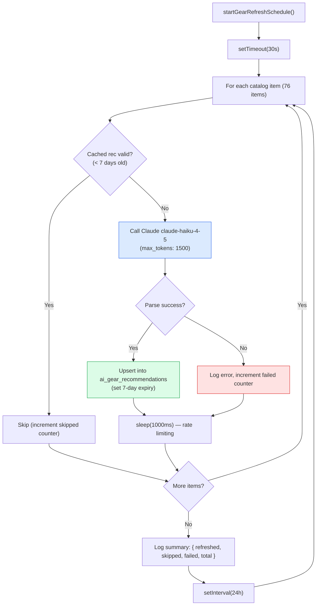

# AI Integration — Readiness Engine

The AI readiness engine generates personalized training plans using Claude's API with a deterministic fallback. This maps to **Exam Domain 1** (Agentic Architecture) and **Domain 5** (Context Management & Reliability).

## Readiness Plan Generation Flow

## Gear Recommendation Batch Flow

## Key Patterns

| Pattern | Implementation | Exam Domain |
|---------|---------------|-------------|
| **Graceful degradation** | Fallback returns same response shape as API | Domain 1, 5 |
| **Model selection** | Sonnet for complex reasoning, Haiku for classification | Domain 1 |
| **Structured output** | JSON schema in prompt, markdown fence stripping | Domain 4 |
| **Cache management** | 7-day TTL, skip valid cached entries | Domain 5 |
| **Rate limiting** | 1s sleep between batch API calls | Domain 1 |
| **Idempotency** | INSERT OR IGNORE for badge awards | Domain 5 |
| **Cost tracking** | tokens_used returned with every response | Domain 5 |
