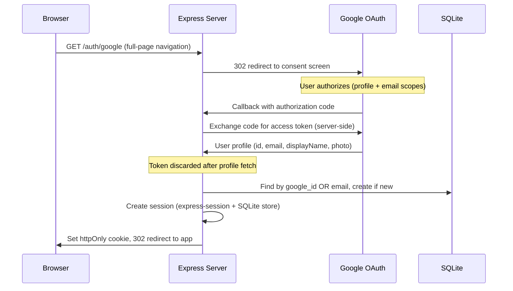
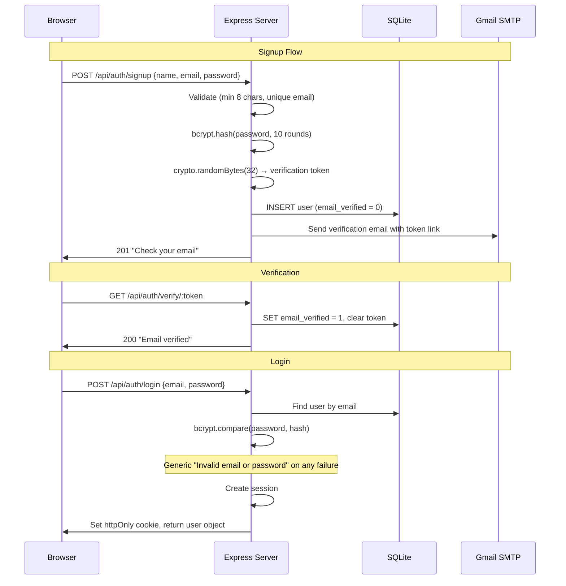

# Authentication Flows

TrailLog supports two authentication methods that create identical server-side sessions. There are no JWTs or client-side tokens.

## Google OAuth 2.0

## Email/Password

## Security Properties

| Property | Implementation |
|----------|---------------|
| No client-side tokens | OAuth code exchange is entirely server-side |
| Generic error messages | Login failures don't reveal if email exists |
| Email verification required | Unverified accounts cannot log in |
| Password reset | Token-based, 1-hour expiry, single-use |
| Session cookie | httpOnly, secure (prod), sameSite=lax, 30-day maxAge |
