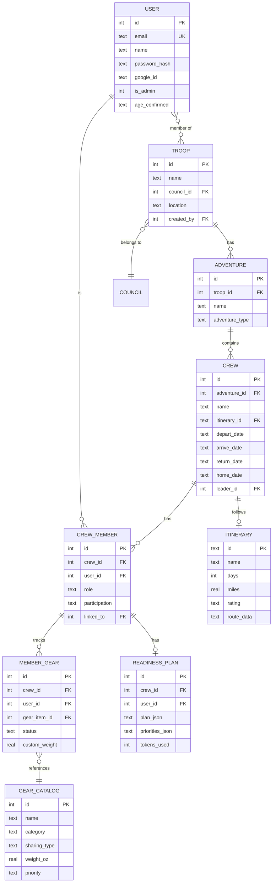

# Data Model

Multi-tenant entity relationship diagram showing the Troop → Adventure → Crew → Member hierarchy and related entities.

## Multi-Tenant Scoping

All database queries include tenant-scoping predicates (`WHERE troop_id = ?`, `WHERE crew_id = ?`) to prevent cross-tenant data access. This is enforced at the database function level in `server/db.js`, not just at the middleware level.
