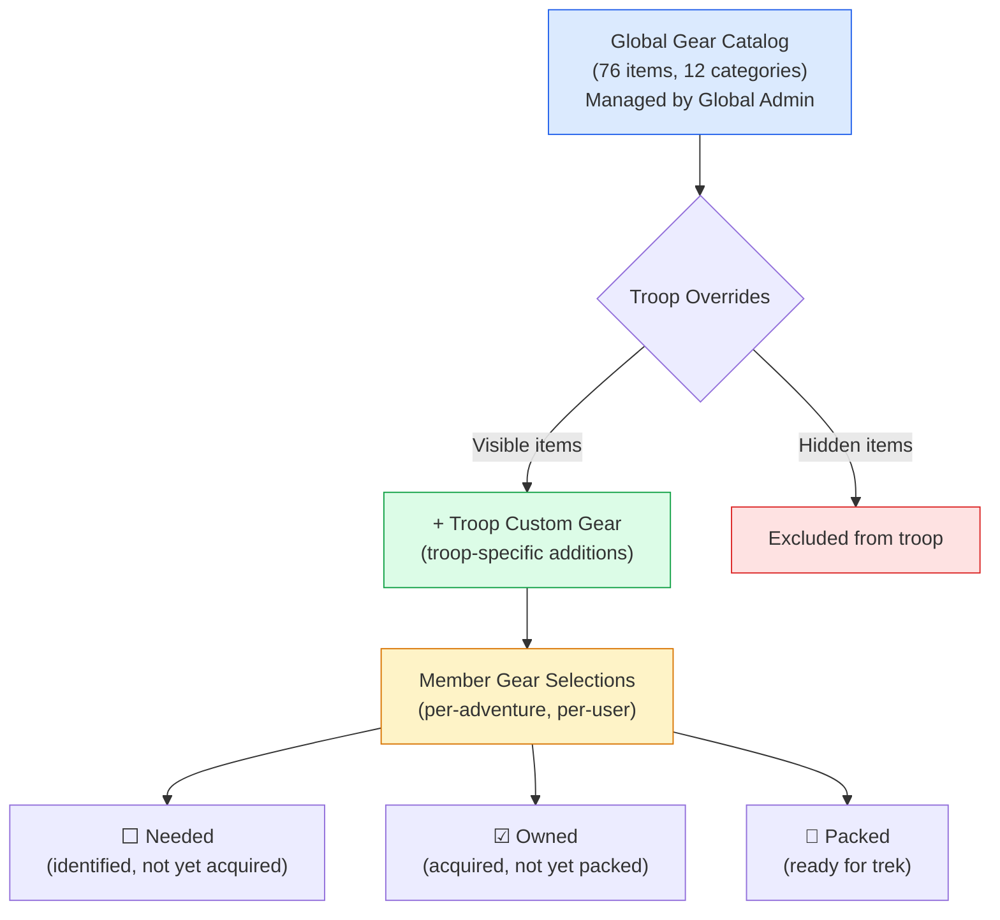
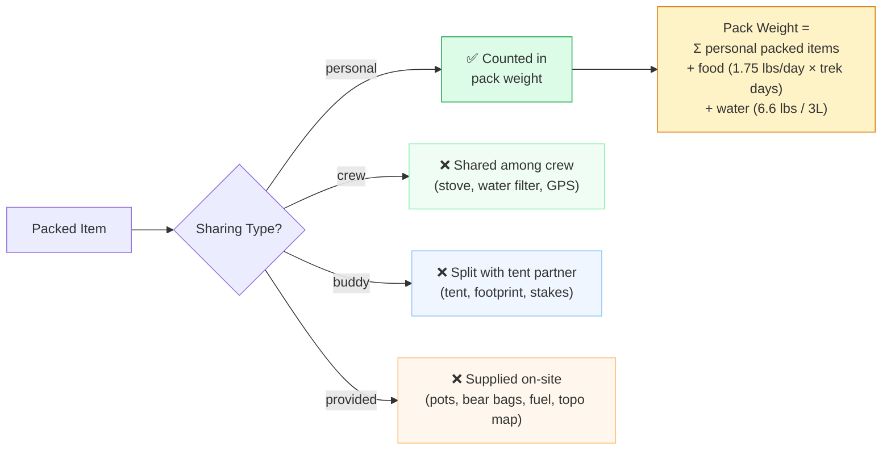

# Gear System

The gear system composes four data layers into a personalized gear list for each crew member, with a dynamic pack weight calculation.

## 4-Layer Composition



## Sharing Types & Pack Weight



## Data Flow

| Layer | Table | Managed By |
|-------|-------|-----------|
| Global Catalog | `gear_catalog` | Global Admin (76 seeded items) |
| Troop Overrides | `troop_gear_overrides` | Troop Admin (hide irrelevant items) |
| Troop Custom | `troop_custom_gear` | Troop Admin (add troop-specific gear) |
| Member Selections | `member_gear_items` | Individual Member (3-state tracking) |

## Pack Weight Formula

```
Pack Weight = Σ(personal items where status = "packed" AND custom_weight > 0)
            + Food Estimate (1.75 lbs/day × itinerary days)
            + Water Weight (6.6 lbs — 3L typical hiking carry)
```

- Only **personal** items with **packed** status count
- Food estimate uses itinerary days (dynamic — changes when itinerary changes)
- Crew, buddy, and provided items displayed but excluded from weight calculation
