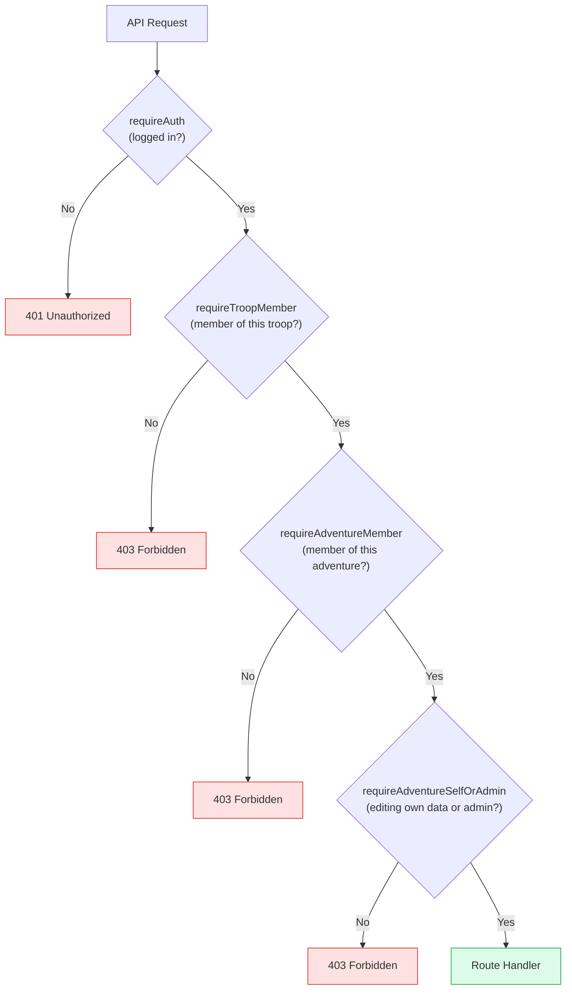

# Middleware Chain

Every HTTP request passes through a 12-step middleware chain before reaching the route handler. This implements defense-in-depth security.

```mermaid
flowchart LR
    A["Incoming<br/>Request"] --> B["1. Public<br/>Settings"]
    B --> C["2. JSON<br/>Parser"]
    C --> D["3. Helmet<br/>CSP/HSTS"]
    D --> E["4. Morgan<br/>Logger"]
    E --> F["5. Auth Rate<br/>Limit"]
    F --> G["6. API Rate<br/>Limit"]
    G --> H["7. Session<br/>(SQLite store)"]
    H --> I["8. Passport<br/>Deserialize"]
    I --> J["9. Maintenance<br/>Check"]
    J --> K["10. CSRF<br/>Verify"]
    K --> L["11. Static<br/>Files"]
    L --> M["12. Route<br/>Handlers"]

    style B fill:#f0fdf4,stroke:#16a34a
    style D fill:#eff6ff,stroke:#2563eb
    style F fill:#fef3c7,stroke:#d97706
    style G fill:#fef3c7,stroke:#d97706
    style J fill:#fee2e2,stroke:#dc2626
    style K fill:#fee2e2,stroke:#dc2626
```

## Middleware Details

| # | Middleware | Purpose | Failure Response |
|---|-----------|---------|-----------------|
| 1 | Public settings route | `GET /api/public-settings` — no auth, served before rate limiter | — |
| 2 | `express.json({ limit: '1mb' })` | Parse JSON request bodies | 413 if > 1MB |
| 3 | `helmet()` | Security headers: CSP, HSTS, X-Frame-Options, nosniff | — |
| 4 | `morgan('short')` | Request logging (method, URL, status, response time) | — |
| 5 | `authLimiter` | Auth endpoints: 20 requests / 15 minutes per IP | 429 |
| 6 | `apiLimiter` | All API endpoints: 100 requests / 1 minute per IP | 429 |
| 7 | `express-session` | Session management backed by SQLite store | — |
| 8 | `passport` | Deserialize user from session cookie | — |
| 9 | Maintenance check | Block non-admin API requests when maintenance mode enabled | 503 |
| 10 | CSRF verification | Validate `X-CSRF-Token` header on POST/PUT/DELETE/PATCH | 403 |
| 11 | `express.static` | Serve built React SPA and static assets | — |
| 12 | Route handlers | Application logic with per-route auth middleware | 400-500 |

## Per-Route Auth Middleware

Route handlers use composable authorization middleware:

