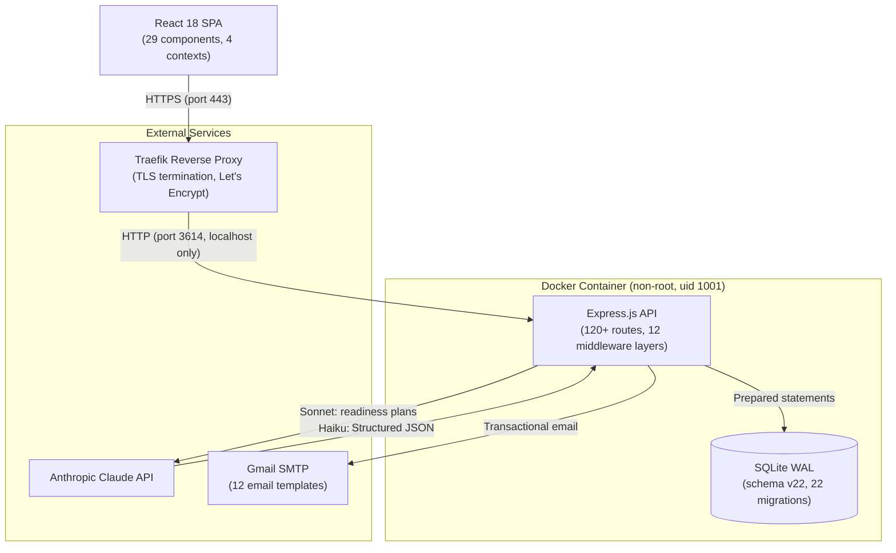

# System Architecture

High-level overview of the TrailLog stack, showing the browser → reverse proxy → application → database path, plus external service integrations (Claude API, Gmail SMTP).

## Key Design Decisions

| Decision | Rationale |
|----------|-----------|
| **SQLite over Postgres** | Single-server deployment; WAL mode provides concurrent reads; no network overhead |
| **Traefik over Nginx** | Auto-certificate management via Let's Encrypt ACME; Docker label-based config |
| **localhost-only port binding** | Container port 3614 bound to 127.0.0.1; all external traffic through Traefik |
| **Non-root container** | `appuser` (uid 1001) limits blast radius of container compromise |
| **Two Claude models** | Sonnet for complex reasoning, Haiku for classification — cost optimization |
